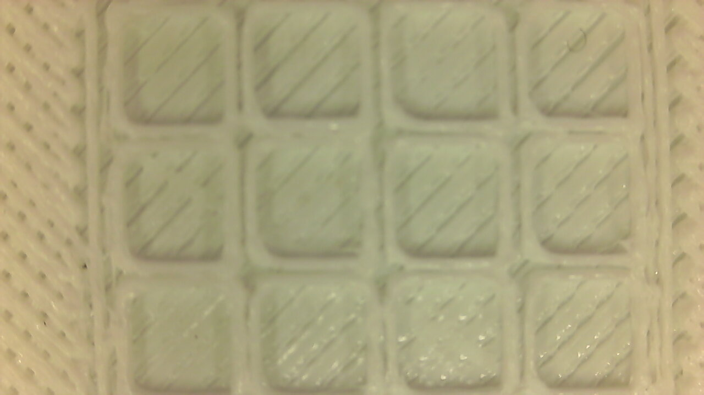
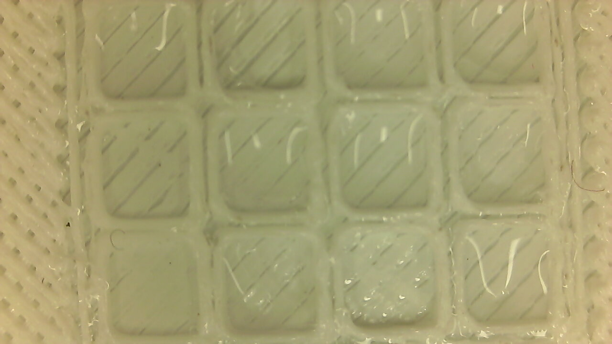
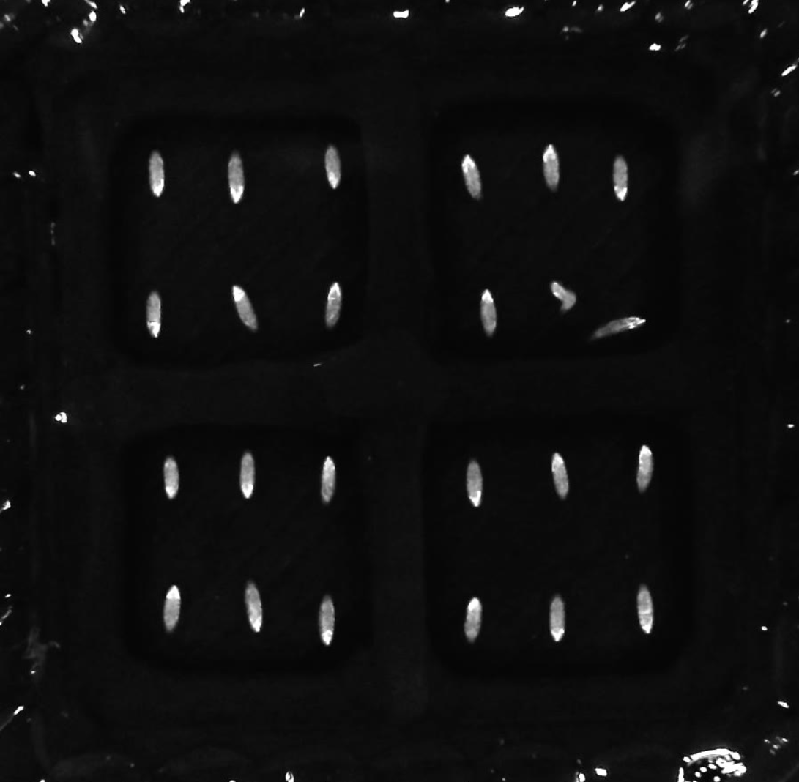
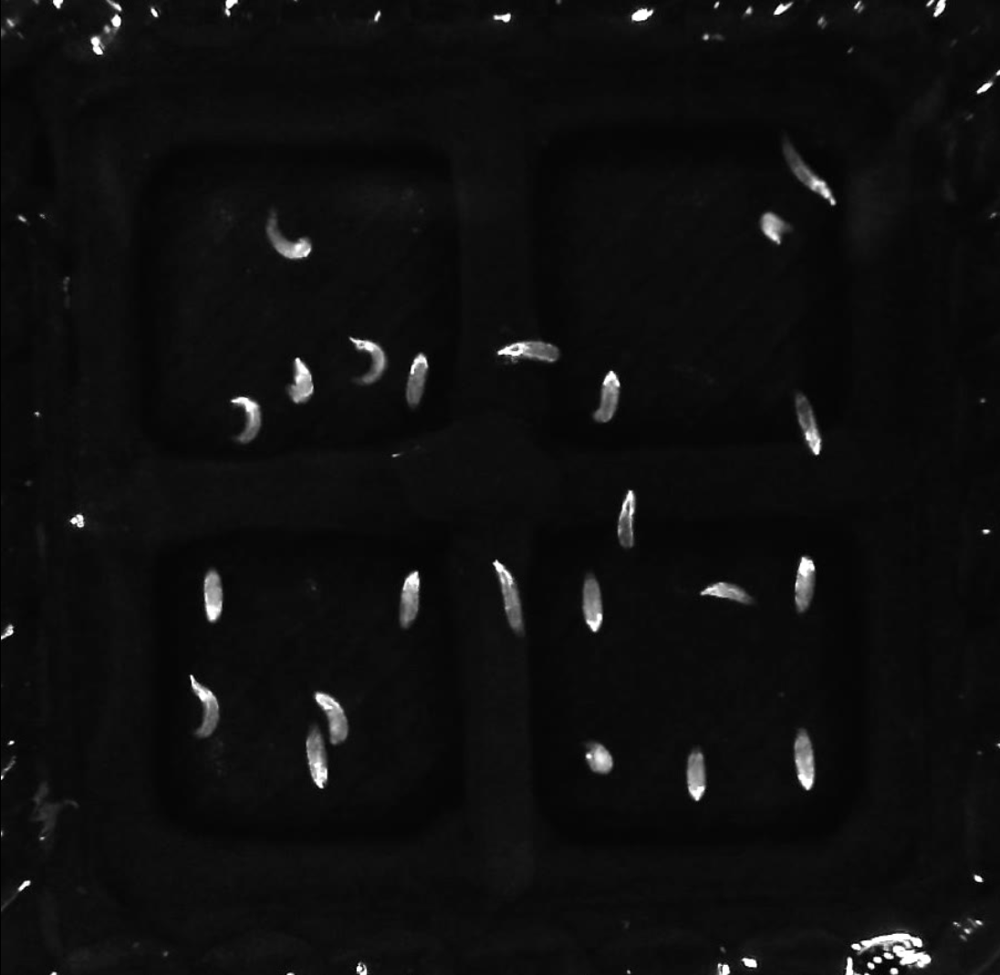

# Drosophila-Embryo-Hatching-Analysis
This is a series of method to analyze drosophila embryo.
This is a sub-research of [Sussex-Neuroscience/embryo-moitoring](https://github.com/Sussex-Neuroscience/embryo-monitoring)

---

## Setup images:


|||
|--|--|
|||

---

## Some initial taken with the setup images:

- note: the printer used to make the grid in the images below was poorly calibrated, the final grid looks much better.

||empty|water|
|--|--|--|
|Visible light|||
|Infra red light|||


### Software analysis:
- Create a jupyter notebook to process the data
 - Subtract running average from brightness average.
 - square square root (so that all values are positive)
 - find hatching point of the embryos (they poke out their heads at the top of the egg shell). This leads normally to a peak on the values of the traces. (maybe shape of the egg.)
  
 - parameters that are calculated from traces:
   - total movement (sum all of the values above a threshold)
   - percentage time moving (number of frames where movement is above the threshold)
   - average movement amplitude (average of movement above a certain threshold)
   - time between first movement and hatching
   - phases movement 
     - high frequency (slow increase and slow decrease)
     - bursts of movement
   - fft analysis
    - bin traces into 30min periods and show how frequency content changes in each bin 

---
Experiment record example
|！[](./media/11.png)|||

---

A [time series classification method](https://github.com/DashPulasr/Drosophila-Embryo-Hatching-Analysis/blob/main/Notebooks/TimeSeriesClassification.ipynb) was applied to clean the experimental data and only the undisturbed larval hatching time series were retained for data analysis.

---
Function examples:


## 1. Hatching Onset Point Detection

From our analysis of experimental video recordings, drosophila embryos did not actually start to move during the initial stages of system operation. And the motion signal we capture is actually a series of noise in the experimental environment. By intercepting the first 5000 frames of motion in the time series, the maximum value is obtained, and then all signals below this threshold are filtered. The first spike is then seen as a signal for the start of hatching.

```python
def knn_norm(data, k=7, mode="max"):
    lenth = len(data)
    output_list = []
    for i in range(lenth - k):
        if mode == "max":
            output_list.append((np.max(data[i:i + k])))
        elif mode == "mean":
            output_list.append((np.mean(data[i:i + k])))
        elif mode == "min":
            output_list.append((np.min(data[i:i + k])))

    return np.hstack((np.ones(lenth-len(output_list))*output_list[0],np.array(output_list)))
    
onset_points=[]
diffs=[]
filtered_signals=[]
for j in tqdm.tqdm(range(24)):
    no=j+1
    normBright = np.array(data["Item" + str(no) + ".avgBright"])
    normBright_max = knn_norm(normBright, 60, "max")
    normBright_min = knn_norm(normBright, 60, "min")
    diff = normBright_max - normBright_min
    diffs.append(copy.deepcopy(diff))
    cut= diff[0:5000]
    threshold= np.max(cut)
    onset_points.append(np.where(diff>threshold)[0][0])
    diff[np.where(diff<=threshold)[0]]=0
    diff[np.where(diff>threshold)[0][0]]=0
    filtered_signals.append(diff)
print("Hatching onset point list is:",onset_points)

```

Plot the onset line

```python
vaildlenth=len(marked_point[marked_point!=0])
f, ax = plt.subplots(vaildlenth, 1, figsize=(20, 5*vaildlenth))
i=0
for j in range(24):
    if marked_point[j+1]!=0:
        ax[i].plot(filtered_signals[j])
        ax[i].vlines(onset_points[j],0,np.max(filtered_signals[i]), linestyles='-',color='blue', label='Predict Hatching Onset point')
        ax[i].vlines(marked_point[j+1], 0,np.max(filtered_signals[i]), linestyles='--', color='orange', label='Hatching point By Jonathan')
        ax[i].grid()
        ax[i].legend()
        i+=1
```

---
## 2. Hatching Complete Point Detection


This method uses a sliding window (window size is 60) to calculate the maximum and minimum values of brightness within the window, thereby generating two new time series. By calculating the difference between the two series we can obtain a time series describing the magnitude of Embryo's motion. By labeling the data, we can find that the hatching point appears at the starting point of the first peak. Using find_peaks of scipy.signal can find these local minima, so as to realize the automatic labeling of hatching points.

```python

hatching_points=[]
maxss=[]
for j in tqdm.tqdm(range(24)):
    no=j+1
    ndiff=knn_norm(diffs[j],8000,"mean")
    increase_point=np.where(ndiff>np.mean(ndiff)*1.2)[0][0]
    cut=ndiff[:increase_point]
    x = np.linspace(0, len(cut), len(cut))
    maxs =find_peaks_cwt(cut[10000:],500)
    maxs+=10000
    cuted=maxs[-2]
    maxss.append((maxs[-2],maxs[-1]))
    cut=cut[maxs[-2]:maxs[-1]]
    mins =find_peaks_cwt(cut**-1,80)
    predict=0
    reverse_min = mins[::-1]
    for i in range(len(mins)):
        if i ==0:
            continue
        else:
            if cut[reverse_min[i]] > cut[reverse_min[i-1]]:
                predict=reverse_min[i-1]+maxs[-2]
                #hatching_points.append(predict)
                break
    if predict<(maxs[-2]+maxs[-1])/2:
        hatching_points.append(int((maxs[-1]+(maxs[-2]+maxs[-1])/2)/2))
    else:
        hatching_points.append(predict)
print("Hatching complete point list is:",hatching_points)
```

Plot the hatching points predictions:
```python

vaildlenth=len(marked_point[marked_point!=0])
f, ax = plt.subplots(vaildlenth, 1, figsize=(20, 5*vaildlenth))
i=0
for j in range(24):
    if marked_point[j+1]!=0:
        ax[i].plot(data["Item"+str(j+1)+".avgBright"])
        ax[i].vlines(maxss[j][0], 10,90, linestyles='-', color='blue',label="Complete point prediction range")
        ax[i].vlines(maxss[j][1], 10,90, linestyles='-', color='blue')
        ax[i].vlines(marked_point[j+1], 10,90, linestyles='--', color='orange', label='Hatching point By Jonathan')
        ax[i].vlines(hatching_points[j], 10,90, linestyles='-', color='orange', label='Hatching point')
        ax[i].grid()
        ax[i].legend()
        i+=1
```
---

## 3.Total Movement Quantity
Sum of values above threshold (between onset and complete)
```python
Sum_above_threshold=[]
for i in range(24):
    Sum_above_threshold.append(len(np.where(filtered_signals[i][onset_points[i]:hatching_points[i]]!=0)[0]))
print("Total Movement Quantity: ",Sum_above_threshold)
```

---

## 4. Average Movement Magnitude
Average of values above threshold
```python
Average_of_values=[]
for i in range(24):
    Average_of_values.append(np.average(data["Item" + str(i+1) + ".avgBright"][np.where(filtered_signals[i][onset_points[i]:hatching_points[i]]!=0)[0]]))
print("Average Movement Magnitude: ",Average_of_values)

```
---
## 5. Duration between movement onset and hatching (as frames or hours/minutes).

```python

Duration=[]
for i in range(24):
    Duration.append(len(filtered_signals[i][onset_points[i]:hatching_points[i]]))
print("Duration between movement onset and hatching: ",Duration)

```
---
## 6. Percentage of time moving
number of frames above threshold/ total frames
```python
Moving_Percentage=[]
for i in range(24):
    Moving_Percentage.append(len(np.where(filtered_signals[i][onset_points[i]:hatching_points[i]]!=0)[0])/len(filtered_signals[i]))
print("Percentage of time moving: ",Moving_Percentage)
```
---
## 7 Average bout length
at some point there are burst of movement intersped with no movement
```python

Average_bout=[]
for i in range(24):
    pos = np.where(filtered_signals[i] > 0)[0]
    split = np.where(np.diff(pos) != 1)[0] + 1
    arr=np.split(filtered_signals[i][pos],split)
    lenths=[]
    for j in arr:
        lenths.append(len(j))
    Average_bout.append(np.mean(lenths))
print(" Average bout length:", Average_bout)

```
---
## 8. FFT Calculation
Bin trace into 30min periods and do fft on each bin. compare differences between them.

```python
#%%
import seaborn as sns
from scipy.fft import rfft,rfftfreq
output=[]
for j in range(24):
    if marked_point[j+1]!=0:
        split_trace=np.split(filtered_signals[j][:99800],10)
        each_trace=[]
        for i in split_trace:
            each_trace.append(np.mean(i))
    output.append(each_trace)
ax=sns.heatmap(output)
plt.show
#%%
output=[]
for j in range(24):
    if marked_point[j+1]!=0:
        split_trace=np.split(np.array(data["Item" + str(j+1) + ".avgBright"])[:99000],9)
        each_trace=[]
        for i in split_trace:
            each_trace.append(np.mean(np.abs(i)[1:]))
    output.append(each_trace)
ax=sns.heatmap(output)
plt.show
```


