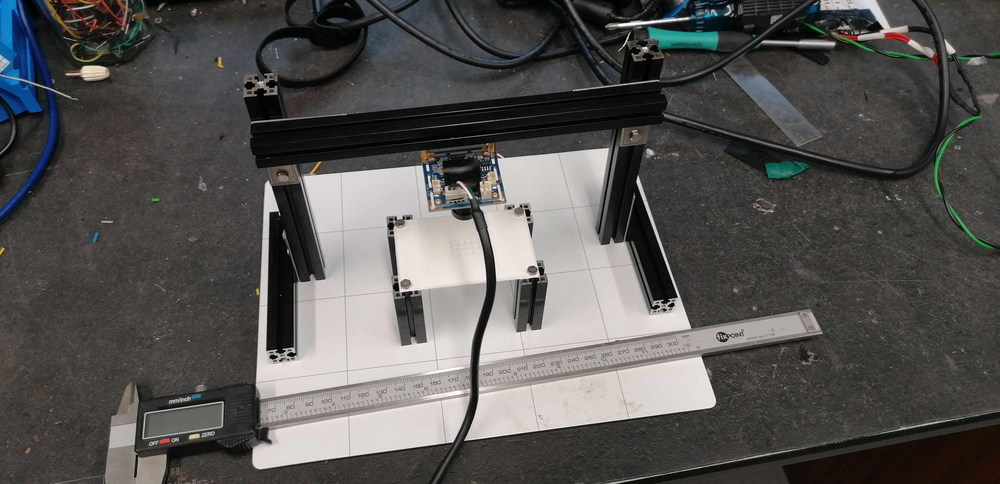
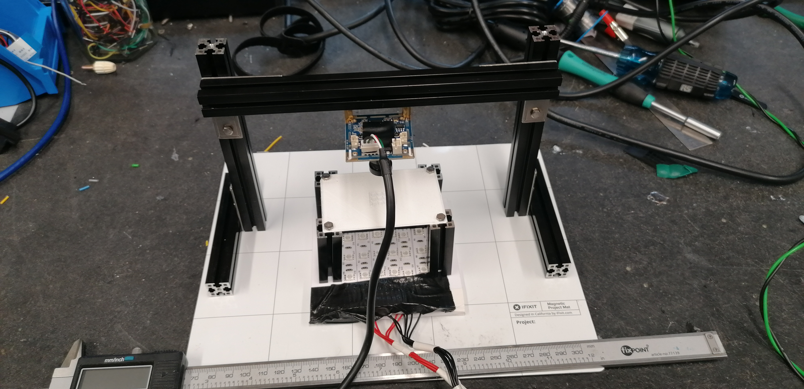

# Drosophila-Embryo-Hatching-Analysis
This is a series of method to analyze drosophila embryo.
This is a sub-research of 

---

## Setup images:

|||
|--|--|
|||

---

## Some initial taken with the setup images:

- note: the printer used to make the grid in the images below was poorly calibrated, the final grid looks much better.

||empty|water|
|--|--|--|
|Visible light|||
|Infra red light|||

### Software analysis:
- Create a jupyter notebook to process the data
 - Subtract running average from brightness average.
 - square square root (so that all values are positive)
 - find hatching point of the embryos (they poke out their heads at the top of the egg shell). This leads normally to a peak on the values of the traces. (maybe shape of the egg.)
  - parameters that are calculated from traces:
   - total movement (sum all of the values above a threshold)
   - percentage time moving (number of frames where movement is above the threshold)
   - average movement amplitude (average of movement above a certain threshold)
   - time between first movement and hatching
   - phases movement 
     - high frequency (slow increase and slow decrease)
     - bursts of movement
   - fft analysis
    - bin traces into 30min periods and show how frequency content changes in each bin 
